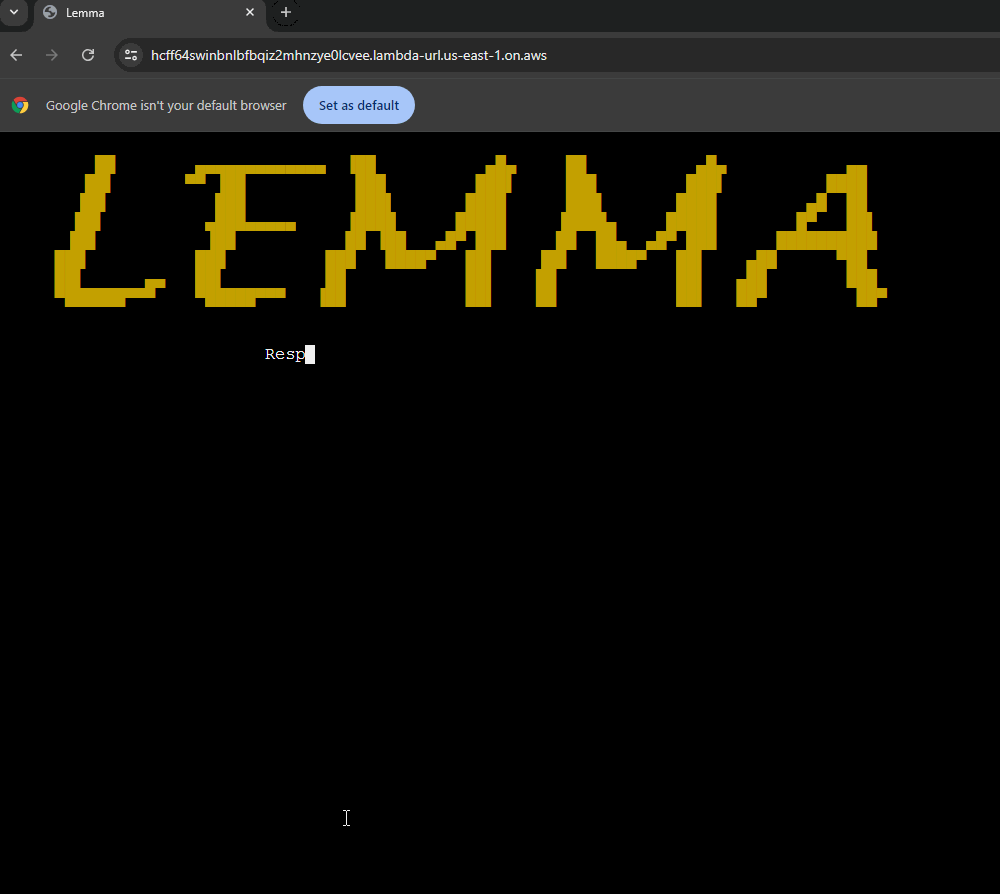
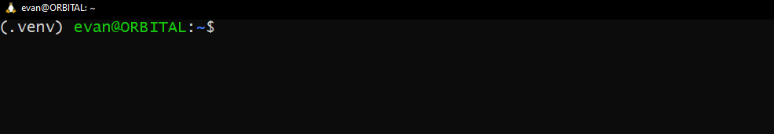
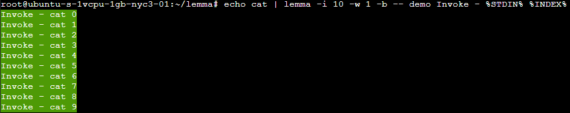
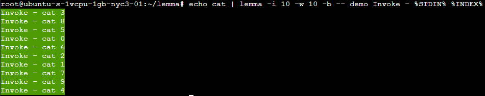
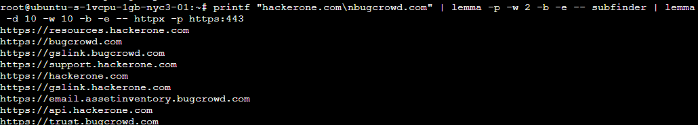
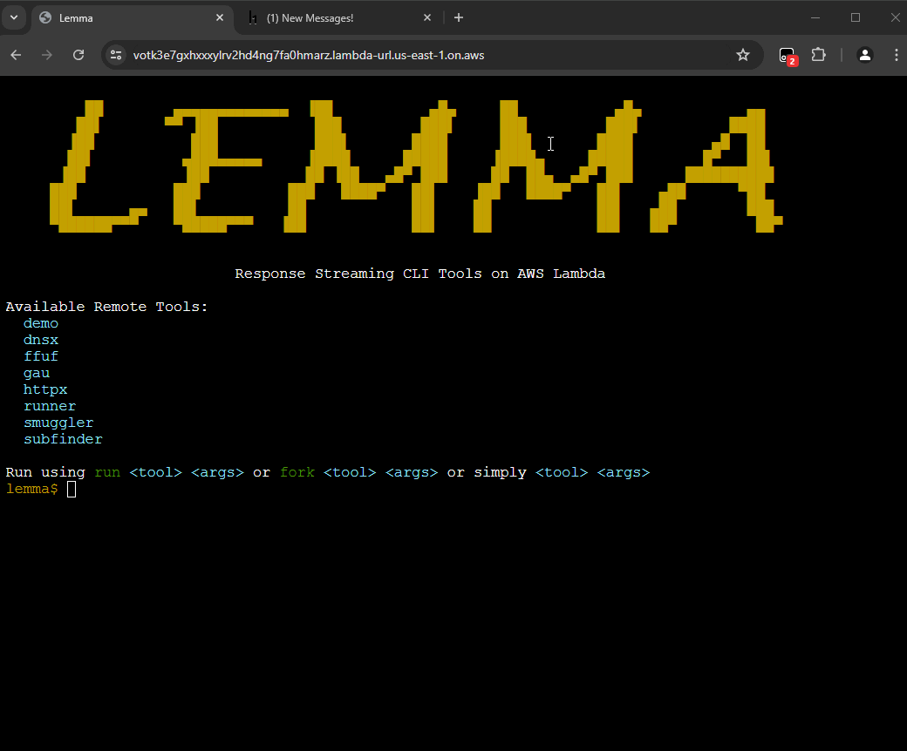

<h1 align="center">
  
  <br>
</h1>

<p align="center">
<a href="https://opensource.org/license/apache-2-0"></a>
<a href="https://github.com/defparam/lemma/issues"></a>
<a href="https://twitter.com/defparam"></a>
</p>

<p align="center">
  <a href="#demo">Demo</a> •
  <a href="#features">Features</a> •
  <a href="#installation">Installation</a> •
  <a href="#lemma-web-client">Web Client</a> •
  <a href="#lemma-terminal-client">Terminal Client</a> •
  <a href="#FAQ">FAQ</a> •
  <a href="#Examples">Examples</a>
</p>

### Disclaimer
The author of this project is not responsible for any damage or data loss incurred as a result of using this software. Use this software at your own risk. While efforts have been made to ensure the accuracy and reliability of the software, it is provided "as is" without warranty of any kind. By using this software, you agree to assume all risks associated with its use. Opinions are that of the author and not that of AWS. Review the [AWS pentesting policy](https://aws.amazon.com/security/penetration-testing/) prior to executing any security tools on AWS Lambda.


# Lemma
Lemma is a Python-based AWS Lambda package and client designed to execute packaged command-line tools in a scalable, remote environment on AWS Lambda. Lemma takes advantage of the new [Response Streaming](https://aws.amazon.com/blogs/compute/introducing-aws-lambda-response-streaming/) feature on AWS Lambda to stream real-time stdout back to the user as the tool is running. The Lemma project comprises three main components:

1) Lemma Lambda Function Package: This package bundles a collection of command-line Linux tools provided by the user, making them accessible via AWS Lambda. It allows users to execute these tools remotely and scale their executions across multiple lambda instances.

2) Web-CLI: This component provides a web-based terminal interface built with [xterm.js](https://xtermjs.org/), [AWS Lambda Web Adapter](https://github.com/awslabs/aws-lambda-web-adapter) and [FastAPI](https://fastapi.tiangolo.com/), accessible via the Lambda URL. This web UI allows users to execute their command-line tools packaged in the Lambda entirely within their web browser.

3) Terminal-CLI: A python-based command-line interface tool in charge invoking the Lemma Lambda function. This tool facilitates the remote execution of the Lambda-hosted tools from a local environment. It pipes stdin and stdout between local and remote tools, providing the ability to execute and scale cli-based workflows onto lambda and back using pipes.

While the intented use case for Lemma is to run verbose security security tooling on AWS lambda, Lemma can be used for any type of command-line tool you wish to run remotely.

# Demo

Web-CLI:
<h1 align="center">
  
  <br>
</h1>
Terminal-CLI:
<h1 align="center">
  
  <br>
</h1>

# Features
- Supports both a Web-CLI and a Terminal-CLI
- Quick and easy build script
- Support for adding your own custom tools
- Support for x86_64 and ARM64 lambda types
- Support for choosing memory, region and timeout
- Flexible terminal piping support

# Installation
## Requirements for Lemma Lambda
1) An AWS account
2) AWS access credentials with permissions to execute cloudformation templates
3) Docker, python3 with pip

## Lambda Build and Deploy Steps
Steps to build and deploy on a fresh Ubuntu 22 instance

1) `sudo apt update`
2) `sudo apt install docker.io python3 python3-pip`
3) `git clone https://github.com/defparam/lemma`
4) `cd lemma`
5) `export AWS_ACCESS_KEY_ID=<your access key id>`
6) `export AWS_SECRET_ACCESS_KEY=<your secret access key>`
7) `./build.sh`
8) Fill out all the questions
9) Copy the lambda URL with the key

Web-CLI:
1) Open chrome and simply browse to your lambda URL w/key

Terminal-CLI:
1) While in the lemma directory: `pip3 install .`
2) Invoke: `lemma`
3) When asked about the lambda URL, paste it into the prompt. This URL will be saved at `~/.lemma/lemma.ini`

Build Walkthrough:
<h1 align="center">
  
  <br>
</h1>

## Lemma Web Client

Lemma's web client is packaged inside the Lemma function itself for easy access. It simply is just 1 html file and 1 javascript file (Also importing xterm.js from CDN). To access it simply just copy and paste your lemma lambda url/key into your chrome web browser and hit enter. For usage details just type the `help` command.

## Lemma Terminal Client

### Usage
```
positional arguments:
  remote_command        lemma <options> -- remote_command

options:
  -h, --help            show this help message and exit
  -w WORKERS, --workers WORKERS
                        Number of concurrent Lambda service workers
  -l, --lambda-url      Prompt user to enter a new lambda url
  -i INVOCATIONS, --invocations INVOCATIONS
                        The number of invocations of the remote command
  -p, --per-stdin       Invoke the remote command for each line of stdin (-i is ignored)
  -d DIV_STDIN, --div-stdin DIV_STDIN
                        Divide stdin into DIV_STDIN parts at a newline boundary and invoke on each (-i is ignored)
  -o, --omit-stdin      Omit stdin to the remote command stdin
  -e, --no-stderr       prevent stderr from being streamed into response
  -b, --line-buffered   Stream only line chunks to stdout
  -v, --verbose         Enable verbose remote output
  -t, --tools           List available tools
  ```

| Remote Command Macro    | Description                                        
|-------------------------|----------------------------------------------------
| `%INDEX%`               | You can place this macro on a remote command to insert the current invocation count into the command (starts at 0)
| `%STDIN%`               | You can place this macro on a remote command to insert any data that may exist on lemma client's stdin. (Warning: new line characters aren't permitted except in -p mode) 

## FAQ

Q: Why did you make this? Aren't there other frameworks?

A: I recently read about a new lambda feature [Response Streaming](https://aws.amazon.com/blogs/compute/introducing-aws-lambda-response-streaming/) that was only a year old and thought about how wonderful it would be in linux to pipe lambda streams together with security tooling because prior to that all responses back from lambda were buffered. Futhermore, I saw lambda's web adapter and though it would be a super neat feature to have lambda present a web page of a terminal to invoke these streaming commands.

Q: Does this work on MacOS or Windows?

A: In theory yes, but at this point i've only tested linux.

Q: Do you support other cloud providers?

A: No, mainly because I'm not sure if other cloud providers even support response streaming with their FaaS product and secondly I don't have the time to research it and make this tool generic.

Q: How do I package my own tools?

A: If you have a normal bash script, simply move it into the `./tools` directory, make it executable and re-build your lambda, its that easy. If your tool installation requires more advanced setup then place those steps into `./tools/install_tools.sh` and re-build your lambda. NOTE: inside a lambda the only writable directory is `/tmp`, so if your tool needs a mutable settings area create a wrapper script to manage it at `/tmp`

Q: Why do you support both arm64 and x86_64?

A: If you end up running A LOT of executions to the point where you care about your AWS bill you may want to use arm64 architecture since it is generally billed cheaper than x86_64. Also billing rates are slightly different depending on the region and memory requirements as well.

Q: Where do I get my `AWS_ACCESS_KEY_ID` and `AWS_SECRET_ACCESS_KEY` ?

A: You can generate it when you log into your AWS account in IAM. I won't go into how to do this since there are plenty of resources you can google.

Q: How come I can only run 10 parallel lambdas at a time?

A: This is a quota set for all new AWS accounts. To increase it to 100-1000 you have to place a quota increase request into AWS through your account.

Q: What's the deal with the `key` parameter on the Lambda URLs?

A: So this lambda application basically provides an RCE API. These lambda URLs are publically accessible. There is a IAM AUTH mode where you can sign your requests with SigV4 but I haven't implemented it yet. As a band-aid solution I added a poor-man's randomly generated API key. When you access it with the key it sets it as a cookie and redirects you back to the root page. If the key is not correct the lambda will return 404. In general I recommend only keeping your lambda url public at times of use then disable/delete it.

Q: Does lambda support streaming data into stdin of a function?

A: No, not at this time. When the client invokes a function all stdin is known and transmitted on invoke. Only stdout of a lambda function supports streaming.

Q: I have a tool/workload that requires more than 15 minutes, how can i increase the lambda timeout?

A: You can't. Lambda is strict on the timeout being max 15 minutes. The way to solve this problem is to break your workflow down to partial executions that execute under 15 minutes.

Q: On the lemma python client what's the deal with these `-i`, `-p` and `-d` modes?

A: These modes are all mutually exclusive and if none of them are specified it is assumed the mode is `-i 1`. The `-i` mode flag allows you to explicitly specify the number of lambda executions of the remote command. The `-p` mode flag tells the client that for all stdin data presented to the client, perform a lambda execution for each "line" of stdin and place that line as stdin into the lambda function unless the user wants it withheld via the `-o` flag. The `-d` mode flag tells the client to consume all stdin at once, split that stdin in parts of `DIV_STDIN` (at a line boundary) and invoke the function for each part. The `-d` mode will not invoke lambda functions until all stdin data is recieved. The `-p` mode will start invoking lambda functions the moment a line is recieve on stdin.

Q: What are remote command macros?

A: Remote command macros are a way for the client to insert data into your remote command. There are currently only 2 macros supported: `%INDEX%` and `%STDIN%`. `%INDEX%` allows you do put the invocation index into an argument of the remote command. This is useful for cases where you need to provide some differentiator between function executions. `%STDIN%` allows you to place what is it stdin onto the remote command. This is useful especially in `-p` mode where you may want to take a line from stdin and apply it as an argument of the remote command.

Q: What's the reason for `-o`, `-b` and `-e` ?

A: `-o` is used when you want to use stdin data but you do not want to send any stdin data to the remote function stdin. This is useful for cases when you want to use `-p` mode and the `%STDIN%` macro so that each line of stdin is only used as a remote command argument. `-b` buffered line mode forces every thread worker to write responses to stdout in line chunks. This is used to prevent data from 2 or more different thread workers from writing to the same line. This is default off because non-buffered byte streaming is important for animated cli tools. Lastly, `-e` tells the remote function to only respond back with stdout, by default both stderr and stdout are sent back in the response stream.

Q: My tool runs super slow, what gives?

A: It's likely that the memory configuration you set for your lambda is too small for the tool you are trying to run. I ran into this issue with `dirsearch` which led me to ultimately remove it from the tools since it wouldn't reliably run without >1GB of memory and ffuf runs beautifully with 256MB of memory. I'm a big proponent of running go-based tools on lambda since it appears to consume much less memory than python.

Q: You are missing tool X, Are you accepting PRs?

A: Yes I know, I haven't spent time curating a good collection of default tools I've been mostly focused on lemma itself. I'm happy to review PRs for tool additions into `./tools/install_tools.sh` if they make sense.

Q: Is this expensive?

A: It really depends on your usage patterns, but if you are casually invoking tools interactively it is amazingly cheap or most likely free. However, use a pricing calculator to get an idea before doing any heavy workloads. There is no lambda executing while you are idling in the Web-CLI. You invoke a lambda each for loading the root html, lemma-term.js and tools.json but after that the only time lambda is invoked is when you run a tool or refresh/open the page again.

Q: I'm scared, what is `./build.sh` doing with my creds?

A: `./build.sh` is running AWS SAM (Serverless Application Model) on a single template, this creates and deploys a cloudformation template that essentially just synthesizes 1 lambda function and a couple of IAM permissions. It is very light weight and you can review the templates used in the `./templates` directory. Also you can review `./build.log` and `./deploy.log` to get an idea of what is going on. In general feel free to review all the code to get a sense of the project. The largest risk is with `./tools/install_tools.sh` blindly pulling in 3rd party software, so feel free to modify that if you are concerned with supply chain risks.

Q: My deploy is failing and the deploy.log says `'MemorySize' value failed to satisfy constraint: Member must have value less than or equal to 3008`. How come?

A: AWS Lambda can technically support memory sizes from 128 to 10240 but the quota limits you to 3008 max. Place a quota increase request into AWS if you need the expanded memory support.

Q: I have a deployed lemma lambda and I'm trying to delete it but `./build.sh` is failing, what do I do?

A: If the delete fails you can always log onto your AWS account in browser, go to the region you deployed into and head over to: `CloudFormation -> Stacks`, click into the `lemma` stack and click `delete`

## Examples

**Example 1:** A 1 worker example showing 10 invocations using STDIN and INDEX macros:

`echo cat | lemma -i 10 -w 1 -b -- demo Invoke - %STDIN% %INDEX%`


**Example 2:** A 10 worker example showing 10 invocations using STDIN and INDEX macros:

`echo cat | lemma -i 10 -w 10 -b -- demo Invoke - %STDIN% %INDEX%`


**Example 3:** A 5 worker example with an invocation per stdin line where the line is used as an argument

`printf "aaa\nbbb\nccc\nddd\neee" | lemma -p -b -w 5 -- demo test:%STDIN%`


**Example 4:** 2 workers running Subfinder pulling domains for hackerone.com and bugcrowd.com whose output goes directly to 10 workers actively checking if https:443 is open on all domains found from subfinder

`printf "hackerone.com\nbugcrowd.com" | lemma -p -w 2 -b -e -- subfinder | lemma -d 10 -w 10 -b -e -- httpx -p https:443`


**Example 5:** Using TamperMonkey scripts to add context menus that forward commands to lemma Web-CLI

Here are some example TamperMonkey scripts:

```js
// ==UserScript==
// @name            lemma: ffuf current host
// @namespace       http://tampermonkey.net/
// @description     Context menu to execute UserScript
// @version         0.1
// @author          author
// @include         *
// @grant           GM_openInTab
// @run-at          context-menu
// ==/UserScript==


(function() {
    'use strict';

    let lemmaurl = "https://votk3e7gxhxxxylrv2hd4ng7fa0hmarz.lambda-url.us-east-1.on.aws/?cmd=";
    let ffufcmd = "run ffuf -w ./tools/wordlists/common.txt -u " + window.location.origin + "/FUZZ -mc 200";
    lemmaurl = lemmaurl + encodeURIComponent(ffufcmd);
    GM_openInTab(lemmaurl, { active: true });

})();
```

```js
// ==UserScript==
// @name            lemma: smuggler current host
// @namespace       http://tampermonkey.net/
// @description     Context menu to execute UserScript
// @version         0.1
// @author          author
// @include         *
// @grant           GM_openInTab
// @run-at          context-menu
// ==/UserScript==


(function() {
    'use strict';

    let lemmaurl = "https://votk3e7gxhxxxylrv2hd4ng7fa0hmarz.lambda-url.us-east-1.on.aws/?cmd=";
    let ffufcmd = "run smuggler -u " + window.location.origin;
    lemmaurl = lemmaurl + encodeURIComponent(ffufcmd);
    GM_openInTab(lemmaurl, { active: true });

})();
```

TamperMonkey/WebCLI Demo:
